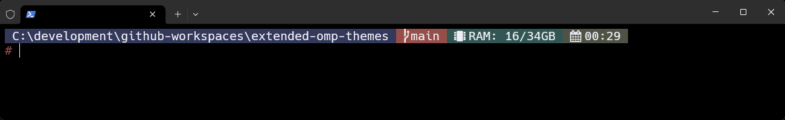

# Themes

Here, you will find a collection of my custom themes for Oh-My-Posh.  
Once you're ready to swap to a theme, follow the steps described in 🚀 [Get started > Customize](https://ohmyposh.dev/docs/installation/customize).

## [Pantone](./themes/pantone.omp.json)

